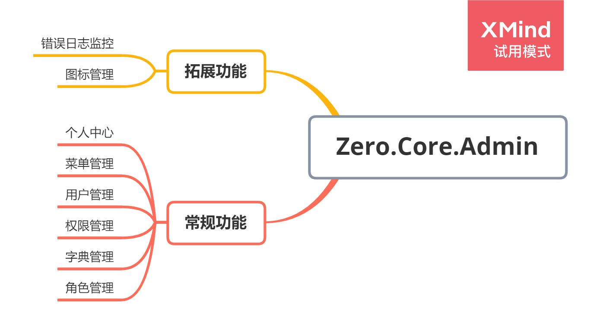

## 1.简介
>Zero.Core.Admin是一个简单的后台管理系统，使用的是vue+element。  
里面有常规的用户、角色、权限等模块管理。  
在这些基础模块之余，还有一些个人实际业务中运用的比较好的案例，这些案例会陆续更新！
如果您是一位C#开发工程师，可以前往该应用的接口程序仓库。  
仓库地址:[前往](https://github.com/QQ2287991080/Zero.Core)  
## 2.开发
>|介绍|说明|
>| :---- | :---- |
>|开发环境|win10|
>|运行环境|Win10|
>|开发工具|VsCode|

## 3.预览
>施工中...
## 4.模块
>用户管理  
>菜单管理  
>角色管理  
>权限管理  
>个人中心  
>未完待续......

**功能和模块接口图**  

## 5.使用
>针对于Zero.Core.Admin的使用我写有一篇博客专门介绍  
 博客地址：https://www.cnblogs.com/aqgy12138/p/13950871.html
>
## 6.计划
如果您只是一位前端开发工程师，那么我会计划在未来的版本中放出适量的可测试的接口供您测试。如果您需要作者为您提供定制化的测试接口那么可以加群联系我。  
QQ群：954591544
